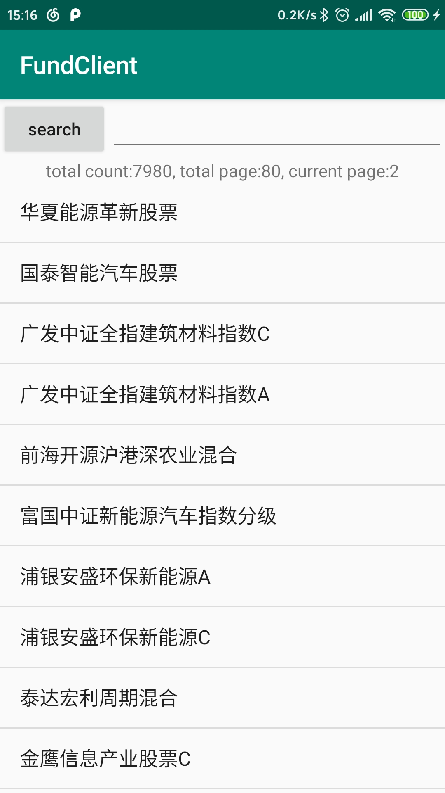
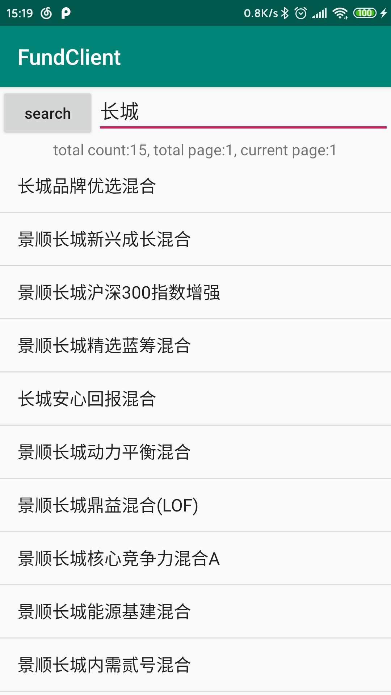
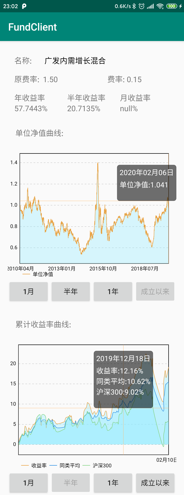

# FundProject

## 运行

1. 后端
   最好python版本>=3.8.1, 低版本python 3没有测试

   执行
   ```shell
   cd ./server
   pip install -r requirements.txt
   python3 server.py
   ```

2. 安卓端
   
   配制FundClient/app/src/main/java/com/mengjie/config/API.java里面的URL地址

## 后端技术

应用Python的协程库aiohttp实现HTTP服务器和爬虫任务

### 数据库

目前还没有使用数据库, 因为:

1. 目前功能相对简单, 还不需要数据库保存数据
2. 如果写一个守护进程去每日更新基金数据到数据库中, 我的电脑空间有限不太适合. 如果是懒保存, 当用户访问某个数据,而数据库里没有,才去更新数据到数据库里,比较麻烦而且不优雅

如果没有需要快速访问基金数据的需求则没必要加入数据库.

### api

采用RESTful风格的API

### 爬虫

由于天天基金网站前后端分离, 未用到解析HTML的python库. 但是网站传输数据竟然是嵌入到JavaScript中的很奇怪, 所以在基金详情爬虫部分, 采用了PyExecJS去直接解析JavaScript代码,性能比较差, 但是比自己处理要简单.

## 实现的功能

1. 基金列表

    获取基金名称的列表展示在客户端
    
    可上下滑动, 当滑倒最底下时会请求第二页的数据, 点击某一项进入基金详情页面

    

2. 基金搜索

    根据名称搜索基金

    

3. 基金详情

    获取基金详情数据,曲线图都可以切换数据范围, 点击某一点可以看到具体数值

    

## 可以展示的数据(来自JavaScript注释???)

- 基金或股票信息
- 原费率
- 现费率
- 最小申购金额
- 基金持仓股票代码
- 基金持仓债券代码
- 基金持仓股票代码(新市场号)
- 基金持仓债券代码（新市场号）
- 收益率
- 近一年收益率
- 近6月收益率
- 近三月收益率
- 近一月收益率
- 股票仓位测算图
- 单位净值走势 equityReturn-净值回报 unitMoney-每份派送金
- 累计净值走势
- 累计收益率走势
- 同类排名走势
- 规模变动 mom-较上期环比
- 持有人结构
- 资产配置
- 业绩评价 ['选股能力', '收益率', '抗风险', '稳定性','择时能力']
- 现任基金经理
- 申购赎回
