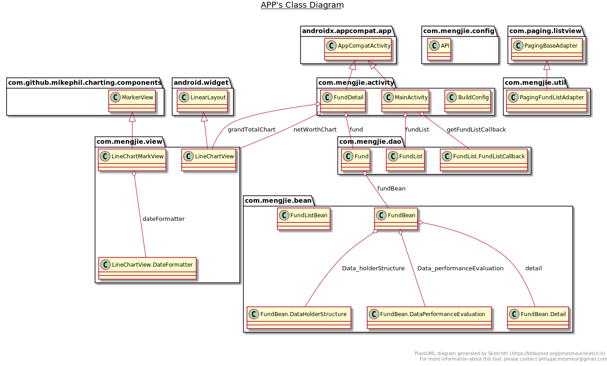
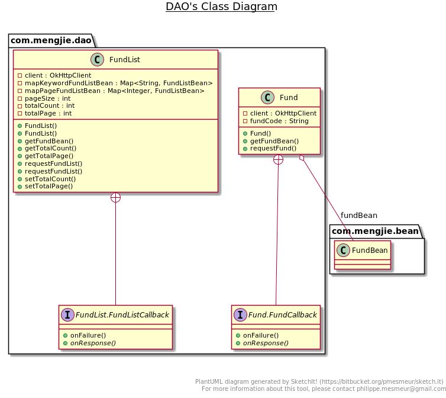
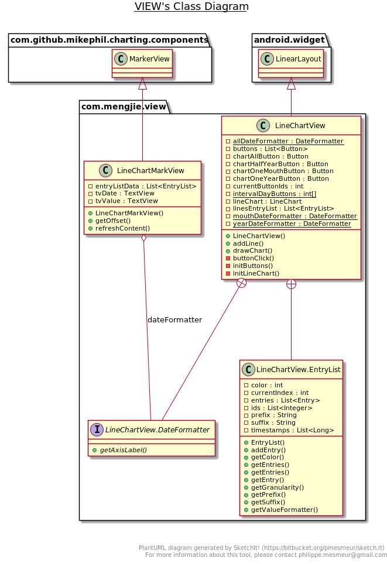

# 1. 基金项目总结

<!-- TOC -->

- [1. 基金项目总结](#1-%e5%9f%ba%e9%87%91%e9%a1%b9%e7%9b%ae%e6%80%bb%e7%bb%93)
  - [1.1. 需求分析](#11-%e9%9c%80%e6%b1%82%e5%88%86%e6%9e%90)
    - [1.1.1. 基本功能](#111-%e5%9f%ba%e6%9c%ac%e5%8a%9f%e8%83%bd)
  - [1.2. 设计](#12-%e8%ae%be%e8%ae%a1)
    - [1.2.1. 技术选型](#121-%e6%8a%80%e6%9c%af%e9%80%89%e5%9e%8b)
      - [1.2.1.1. 后端](#1211-%e5%90%8e%e7%ab%af)
      - [1.2.1.2. 前端](#1212-%e5%89%8d%e7%ab%af)
      - [1.2.1.3. 前后端通信](#1213-%e5%89%8d%e5%90%8e%e7%ab%af%e9%80%9a%e4%bf%a1)
    - [1.2.2. 后端](#122-%e5%90%8e%e7%ab%af)
      - [1.2.2.1. 爬虫网站分析](#1221-%e7%88%ac%e8%99%ab%e7%bd%91%e7%ab%99%e5%88%86%e6%9e%90)
      - [1.2.2.2. API设计](#1222-api%e8%ae%be%e8%ae%a1)
      - [1.2.2.3. 格式化json数据](#1223-%e6%a0%bc%e5%bc%8f%e5%8c%96json%e6%95%b0%e6%8d%ae)
    - [1.2.3. android端](#123-android%e7%ab%af)
      - [1.2.3.1. 总体UML图](#1231-%e6%80%bb%e4%bd%93uml%e5%9b%be)
      - [1.2.3.2. 主要架构思路](#1232-%e4%b8%bb%e8%a6%81%e6%9e%b6%e6%9e%84%e6%80%9d%e8%b7%af)
  - [1.3. 总结](#13-%e6%80%bb%e7%bb%93)

<!-- /TOC -->

## 1.1. 需求分析

### 1.1.1. 基本功能

1. 获取基金列表
   
   由于基金数量多, 需要进行分页. 且需要搜索功能帮助用户更快定位自己关注的基金.

2. 查看某个基金的信息(名称,净值等信息)

## 1.2. 设计

### 1.2.1. 技术选型

#### 1.2.1.1. 后端

框架采用 python aiohttp库, 因为对python协程比较感兴趣特别使用.

#### 1.2.1.2. 前端

安卓端, 采用原生android框架java语言编写

网络访问: okhttp3

json解析: gson

画图表: MPAndroidChart

#### 1.2.1.3. 前后端通信

采用HTTP协议,RESTFul风格API,数据存储在json中.

### 1.2.2. 后端

#### 1.2.2.1. 爬虫网站分析

代码在: [server/spider](https://github.com/ImportMengjie/FundProject/tree/master/server/spider)

分析天天基金网站:

1. 基金列表:

    URL: <http://fund.eastmoney.com/Data/Fund_JJJZ_Data.aspx?page=1&pagesize=100>

    return: JavaScript代码, 由于比较简单, 通过修改字符串使其符合json语法.

2. 基金搜索:
   
   URL: <http://fundsuggest.eastmoney.com/FundSearch/api/FundSearchPageAPI.ashx?m={}&_={}&key={}>

   return: json数据可直接返回

3. 基金详情

    URL: <http://fund.eastmoney.com/pingzhongdata/{fund_code}.js>

    return: JavaScript代码, 由于过于复杂, 使用execjs库执行该JavaScript代码, 再从中获取某个变量的值写入json中返回

#### 1.2.2.2. API设计

代码在: [server/resources](https://github.com/ImportMengjie/FundProject/tree/master/server/resources)

1. 基金列表(包括搜索)

    URL: /api/fund?page={}&pagesize={}&keyword={}

    Method: GET

    其中keyword是可选参数, 如果有keyword则代表是搜索请求

    由于搜索本身的返回结果也是基金的列表, 所以不必单独设置API

2. 基金详情

    URL: /api/fund/{fund_code}

    Method: GET

    其中fund_code从基金列表中可以获取.

#### 1.2.2.3. 格式化json数据

代码在: [server/format](https://github.com/ImportMengjie/FundProject/tree/master/server/format)

处理返回json的格式. 并且对于一些如 净值数据, 将缺失的时间戳数据补齐, 减少前端工作量.

### 1.2.3. android端

#### 1.2.3.1. 总体UML图

#### 1.2.3.2. 主要架构思路

1. 数据通信
    
    [com.mengjie.bean](https://github.com/ImportMengjie/FundProject/tree/master/FundClient/app/src/main/java/com/mengjie/bean) 中包含java bean class 用于使用Gson库将后端传入的json对象解析成java对象实例.

    [com.mengjie.dao](https://github.com/ImportMengjie/FundProject/tree/master/FundClient/app/src/main/java/com/mengjie/dao) 中用于请求后端将数据转换成java bean并保存. 由于android不允许在UI线程进行阻塞操作(IO), 所以需要新建线程注册回调, 由该包下的class负责调用回调.

    UML图如下:

    

2. 图表封装

    由于MPAndroidChart使用起来非常麻烦, 并且需要画多个图, 所以需要得体的封装. 这里将图表和下边的按钮(切换时间范围)封装成android的view, 可以直接在布局文件中使用. 

    封装EntryList保存画图所需数据点和时间戳等信息, 也需要处理有些日期没有数据. 通过LineChartView.addLine添加EntryList, 可以添加多条线, 最后调用drawChart方法将添加的数据线画到图中.

    UML图如下:

    

## 1.3. 总结

后端主要是一些协程相关的知识学习, 前期看了<<流畅的python>>这本书系统的学习了协程的基本概念, 在开发中体验到协程的方便, 并且应用起来并没有很复杂, 相反就如同写普通的同步程序.

爬虫方面, 天天基金采用了前后端分离, 数据单独传输, 所以省去了麻烦的解析html工作, 但是他传输数据采用JavaScript代码, 我觉得这样非常不专业,数据传输应该用json, 直接传输JavaScript代码实在是太奇葩了...

前端方面, 主要是看<<第一行代码>>学习了android的基本概念. 封装图表类是比较麻烦的地方, MPAndroidChart 相较于之前用过的图表库的确是有些许难用, 如果不进行大量设置, 图表会非常的难看... 另外java语言是纯面向对象的语言, 很强调设计, 在写基金列表时没有考虑到搜索基金这一功能, 导致添加搜索基金功能时,代码变得很难看; 在图表方面,开始没有封装成view并且没有考虑画多条线的功能, 导致图表方面的完全重构. 由于很久没有写java并且第一次写android程序, 所以代码有一些地方欠考虑, 比如ip地址的配置, 这里直接写在类中的静态变量; 布局文件没有严格遵循规则(将字符串单独存储, 样式单独存储等). 面向对象的思想也有些许遗忘, 在写一些回调接口地方也有点晕...